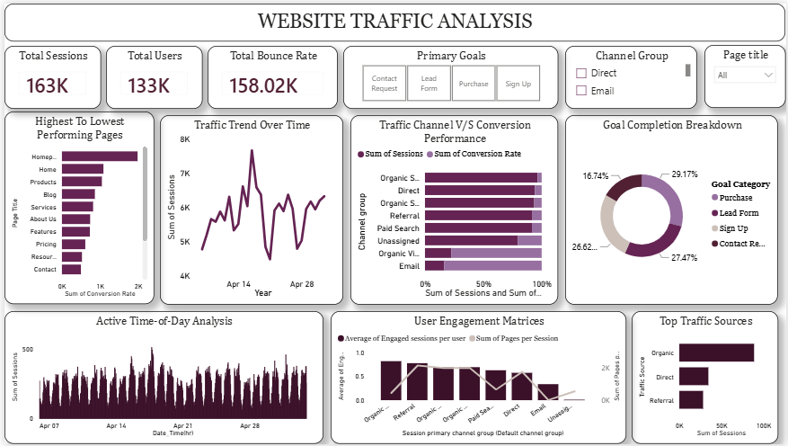

# Website-Traffic-Analysis 
@syntecxhub| Website Traffic Analysis Dashboard | An interactive Website Traffic Analysis Dashboard built using Microsoft Power BI to analyze website performance, visitor behavior, traffic sources, engagement, and goal conversions.

# Dashboard Highlights
1.) Key Performance Indicators: Total Sessions, Total Users, and Total Bounce Rate. 

2.) Traffic Trends: Tracks website sessions over time to identify traffic patterns and fluctuations. 

3.) Top Performing Pages: Compares pages based on their traffic and conversion performance.

4.) Traffic Channel Analysis: Evaluates different channels such as Organic Search, Direct, Referral, Paid Search, Email, and Unassigned.

5.) Goal Completion Breakdown: Visualizes conversions across goals including Purchase, Lead Form, Sign Up, and Contact Request.

6.) Active Time-of-Day Analysis: Identifies periods with higher website activity.

7.) User Engagement Analysis: Examines engaged sessions and engagement per user across different traffic channels.

8.) Top Traffic Sources: Highlights the sources generating the highest number of website sessions. 

9.) Interactive Filters: Allows users to filter the dashboard by channel group and page title.

# Tools & Technologies
Microsoft Power BI
Microsoft Excel / CSV

# Objective
The dashboard provides a consolidated view of website traffic and user behavior, helping identify high-performing pages, major traffic sources, engagement patterns, and conversion trends for data-driven website analysis.

# Dashboard Preview

